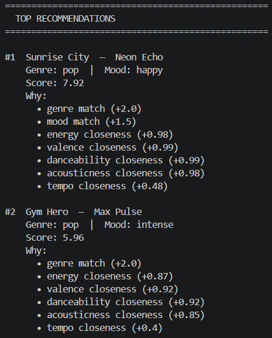
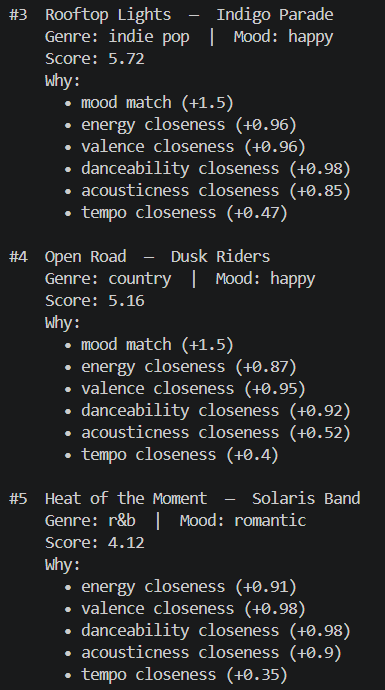

# 🎵 Music Recommender Simulation

## Project Summary

In this project you will build and explain a small music recommender system.

Your goal is to:

- Represent songs and a user "taste profile" as data
- Design a scoring rule that turns that data into recommendations
- Evaluate what your system gets right and wrong
- Reflect on how this mirrors real world AI recommenders

Replace this paragraph with your own summary of what your version does.

---

## How The System Works

# Algorithm Recipe: Scoring Each Songs
- Rule 1: Matched Genre (categorical - 0.35)
- Rule 2: Mood Match (categorical - 0.25)
- Rule 3: Energy Proximity (numeric - 0.25) → (1.0 - abs(song.energy - user.target_energy))
- Rule 4: Acoustic Preference (boolean - 0.15)
- Score = (genre_match * W1) + (mood_match * W2) + (energy_score * W3) + (acoustic_match * W4)

# Explain your understanding of how real-world recommendations work and what your version (recommender system) will prioritize:
- My basic understaning to how the recommendation system works was that it tracks the user's music history. It tracks the music's elements such as genre, mood, or tempo to filter out musics or content-based filtering and such. My version of the recommender system will prioritize the Scoring System for songs which inlucdes 4 rules which are the Genre Matched, Mood Matched, Energy Proximity, and Acoustic Preferences.

# [Finalized Algorithm Recipe] #
score_song(song, user_prefs) → (float, str)

INPUTS
  song        — one row from songs.csv as a dict
  user_prefs  — the taste profile dict from main.py

SCORING RULES
  score = 0.0
  reasons = []

  1. GENRE MATCH (categorical, hard match)
     if song["genre"] == user_prefs["favorite_genre"]:
         score += 2.0
         reasons += ["genre match"]

  2. MOOD MATCH (categorical, hard match)
     if song["mood"] == user_prefs["favorite_mood"]:
         score += 1.0
         reasons += ["mood match"]

  3. ENERGY SIMILARITY (numeric, continuous)
     energy_diff = abs(song["energy"] - user_prefs["target_energy"])
     energy_score = max(0.0, 1.0 - energy_diff)   # 1.0 if perfect, 0.0 if diff ≥ 1.0
     score += energy_score
     if energy_diff < 0.15:
         reasons += ["energy is close"]

  --- OPTIONAL EXTENSIONS (add if you want a richer recipe) ---

  4. ACOUSTICNESS BOOST (boolean gate)
     if user_prefs["likes_acoustic"] and song["acousticness"] > 0.70:
         score += 0.5
         reasons += ["acoustic texture"]

  5. TEMPO SIMILARITY (numeric, same pattern as energy)
     tempo_diff = abs(song["tempo_bpm"] - user_prefs["target_tempo_bpm"]) / 200
     score += max(0.0, 0.5 - tempo_diff)   # max 0.5 points, scaled by 200 BPM range

RETURN
  explanation = ", ".join(reasons) or "no strong match"
  return (score, explanation)

MAX POSSIBLE SCORE
  Base rules only:    4.0  (2.0 + 1.0 + 1.0)
  With extensions:    5.0  (+ 0.5 acoustic + 0.5 tempo)


# Mermaid.js Flowchart
flowchart TD
    A[User Preferences\ngenre · mood · energy · tempo\nvalence · danceability · acousticness · likes_acoustic] --> B

    B[load_songs\nParse songs.csv into a list of song dicts] --> C

    C{For each song in the list}

    C --> D[score_song\nCompare song attributes\nagainst user preferences]

    D --> E{Categorical match?\ngenre · mood}
    E -->|Yes| F[Add genre/mood bonus]
    E -->|No| G[No bonus]

    F --> H[Numeric proximity scoring\nenergy · tempo · valence\ndanceability · acousticness]
    G --> H

    H --> I{likes_acoustic flag set?}
    I -->|True| J[Apply acousticness boost]
    I -->|False| K[No boost]

    J --> L[Final score + explanation string]
    K --> L

    L --> C

    C -->|All songs scored| M[Sort all songs by score descending]
    M --> N[Slice top K results]
    N --> O[Output: Top K Recommendations\nsong · score · explanation]


# Documenting the Plan of the Data Recommender will be use
- The Plan is that the Reccommender System basically reads the datas in songs.csv and gathers their attributes (genre, energy and such) and compares it to the User's Taste Profile in #file:main.py which also holds attributes. It then score each songs by comparing it to the User's preferebces where if the Genre matches +2, Mood Matches +1, Energy closed to Target Energy +0-1, and close to Acoustic then +0.5.

# Potential Biases Expected
- The Genre having more Weight than the others, causing mismatched matches.
- The Mood of Songs must match the exact mood it is searching for, causing similar moods not to be matched.
- There is no diversity of songs, always picking the closest thing to match.

Explain your design in plain language.

Some prompts to answer:

- What features does each `Song` use in your system
  - For example: genre, mood, energy, tempo
- What information does your `UserProfile` store
- How does your `Recommender` compute a score for each song
- How do you choose which songs to recommend

You can include a simple diagram or bullet list if helpful.
- `Song` Features:
  - Genre
  - Mood
  - Energy
  - Acoustic
- `UserProfile` Features:
  - Favorite_Genre
  - Favorite_Mood
  - Target_Energy
  - Likes_Acoustic
- `Recommender` Computation of Song Scores
  - Song.Genre = Favorite_Genre
  - Song.Mood = Favorite_Mood
  - 1.0 - abs(Song.Energy - Target_Energy)
  - If User Likes_Acoustic → Acoustic Pref = 1, else 0.

# Terminal Image
<a href="Music_Reco_1.png" target="_blank"></a>
<a href="Music_Reco_2.png" target="_blank"></a>

---

## Getting Started

### Setup

1. Create a virtual environment (optional but recommended):

   ```bash
   python -m venv .venv
   source .venv/bin/activate      # Mac or Linux
   .venv\Scripts\activate         # Windows

2. Install dependencies

```bash
pip install -r requirements.txt
```

3. Run the app:

```bash
python -m src.main
```

### Running Tests

Run the starter tests with:

```bash
pytest
```

You can add more tests in `tests/test_recommender.py`.

---

## Experiments You Tried

Use this section to document the experiments you ran. For example:

- What happened when you changed the weight on genre from 2.0 to 0.5
- What happened when you added tempo or valence to the score
- How did your system behave for different types of users

---

## Limitations and Risks

Summarize some limitations of your recommender.

Examples:

- It only works on a tiny catalog
- It does not understand lyrics or language
- It might over favor one genre or mood

You will go deeper on this in your model card.

---

## Reflection

Read and complete `model_card.md`:

[**Model Card**](model_card.md)

Write 1 to 2 paragraphs here about what you learned:

- about how recommenders turn data into predictions
- about where bias or unfairness could show up in systems like this


---

## 7. `model_card_template.md`

Combines reflection and model card framing from the Module 3 guidance. :contentReference[oaicite:2]{index=2}  

```markdown
# 🎧 Model Card - Music Recommender Simulation

## 1. Model Name

Give your recommender a name, for example:

> VibeFinder 1.0

---

## 2. Intended Use

- What is this system trying to do
- Who is it for

Example:

> This model suggests 3 to 5 songs from a small catalog based on a user's preferred genre, mood, and energy level. It is for classroom exploration only, not for real users.

---

## 3. How It Works (Short Explanation)

Describe your scoring logic in plain language.

- What features of each song does it consider
- What information about the user does it use
- How does it turn those into a number

Try to avoid code in this section, treat it like an explanation to a non programmer.

---

## 4. Data

Describe your dataset.

- How many songs are in `data/songs.csv`
- Did you add or remove any songs
- What kinds of genres or moods are represented
- Whose taste does this data mostly reflect

---

## 5. Strengths

Where does your recommender work well

You can think about:
- Situations where the top results "felt right"
- Particular user profiles it served well
- Simplicity or transparency benefits

---

## 6. Limitations and Bias

Where does your recommender struggle

Some prompts:
- Does it ignore some genres or moods
- Does it treat all users as if they have the same taste shape
- Is it biased toward high energy or one genre by default
- How could this be unfair if used in a real product

---

## 7. Evaluation

How did you check your system

Examples:
- You tried multiple user profiles and wrote down whether the results matched your expectations
- You compared your simulation to what a real app like Spotify or YouTube tends to recommend
- You wrote tests for your scoring logic

You do not need a numeric metric, but if you used one, explain what it measures.

---

## 8. Future Work

If you had more time, how would you improve this recommender

Examples:

- Add support for multiple users and "group vibe" recommendations
- Balance diversity of songs instead of always picking the closest match
- Use more features, like tempo ranges or lyric themes

---

## 9. Personal Reflection

A few sentences about what you learned:

- What surprised you about how your system behaved
- How did building this change how you think about real music recommenders
- Where do you think human judgment still matters, even if the model seems "smart"

